# Racky Backend Entity Relationship Diagram

Este archivo contiene el diagrama de relaciones entre entidades (ERD) del backend de Racky. **Debe mantenerse actualizado** cada vez que se modifiquen las entidades o se creen nuevas.

## Diagrama ER (Mermaid)

```mermaid
erDiagram
    User {
        ObjectId _id PK
        String email UK
        String password
        String firstName
        String lastName
        String role
        Boolean isActive
        String subscriptionStatus
        String subscriptionPlan
        Date trialEndsAt
        Date subscriptionEndsAt
        String companyName
        String stripeCustomerId
        String stripeSubscriptionId
        String timezone
        String language
        Date createdAt
        Date updatedAt
    }

    StoreConnection {
        ObjectId _id PK
        ObjectId userId FK
        String storeName
        String marketplaceType
        Mixed credentials
        Boolean isActive
        Date lastSync
        String syncStatus
        Date createdAt
        Date updatedAt
    }

    Product {
        ObjectId _id PK
        ObjectId userId FK
        ObjectId storeConnectionId FK
        String title
        String description
        Number price
        Number compareAtPrice
        String sku
        String barcode
        Number inventory
        String vendor
        String productType
        Array tags
        Array images
        Array variants
        Array platforms
        String status
        String shopifyId
        String handle
        Date shopifyCreatedAt
        Date shopifyUpdatedAt
        String marketplace
        String externalId
        String marketplaceUrl
        String currency
        Number stock
        String category
        Date lastSyncedAt
        Array cachedDescriptions
        Date createdAt
        Date updatedAt
    }

    Opportunity {
        ObjectId _id PK
        ObjectId userId FK
        ObjectId productId FK
        String category
        String marketplace
        String title
        String description
        String priority
        String status
        Object potentialImpact
        String actionRequired
        Date dueDate
        Date cachedAt
        Date expiresAt
        Object aiMetadata
        String type
        Date createdAt
        Date updatedAt
    }

    Suggestion {
        ObjectId _id PK
        ObjectId userId FK
        ObjectId productId FK
        String platform
        String type
        String title
        String description
        String originalContent
        String suggestedContent
        String status
        Object metadata
        Object opportunityData
        Mixed currentValue
        Mixed suggestedValue
        Number confidence
        String estimatedImpact
        Date createdAt
        Date updatedAt
    }

    Plan {
        ObjectId _id PK
        String name UK
        String displayName
        String description
        Number monthlyPrice
        Number yearlyPrice
        String currency
        String stripeMonthlyPriceId
        String stripeYearlyPriceId
        Object limits
        Array features
        Boolean isActive
        Boolean isPublic
        Number sortOrder
        Number trialDays
        Date createdAt
        Date updatedAt
    }

    Subscription {
        ObjectId _id PK
        ObjectId userId FK
        ObjectId planId FK
        String status
        String stripeSubscriptionId UK
        String stripeCustomerId
        Number amount
        String currency
        String interval
        Date startsAt
        Date endsAt
        Date nextBillingDate
        Date lastBillingDate
        Boolean cancelAtPeriodEnd
        Date cancelledAt
        String cancellationReason
        Date suspendedAt
        String suspensionReason
        Boolean paymentFailed
        Date paymentFailedAt
        Array expirationWarningsSent
        Boolean expiredNotificationSent
        Boolean cancellationNotificationSent
        Boolean suspensionNotificationSent
        Mixed metadata
        Date createdAt
        Date updatedAt
    }

    Usage {
        ObjectId _id PK
        ObjectId userId FK
        Number year
        Number month
        Number apiCalls
        Number productsSync
        Number storesConnected
        Number storageUsed
        Object features
        Date billingPeriodStart
        Date billingPeriodEnd
        Date createdAt
        Date updatedAt
    }

    GeneralSuggestion {
        ObjectId _id PK
        ObjectId userId FK
        String title
        String description
        String priority
        String category
        String impact
        Object context
        Date expiresAt
        Boolean isActive
        Date createdAt
        Date updatedAt
    }

    OpportunityCategory {
        ObjectId _id PK
        String id UK
        String name
        String description
        String icon
        String color
        Boolean isMarketplace
        Boolean isActive
        Date createdAt
        Date updatedAt
    }

    %% Relationships
    User ||--o{ StoreConnection : "owns"
    User ||--o{ Product : "owns"
    User ||--o{ Opportunity : "has"
    User ||--o{ Suggestion : "receives"
    User ||--o{ Subscription : "has"
    User ||--o{ Usage : "tracks"
    User ||--o{ GeneralSuggestion : "receives"
    
    StoreConnection ||--o{ Product : "contains"
    
    Product ||--o{ Opportunity : "generates"
    Product ||--o{ Suggestion : "gets"
    
    Plan ||--o{ Subscription : "defines"
    
    %% Additional notes on cardinality
    %% User (1) to StoreConnection (N) - One user can have multiple store connections
    %% StoreConnection (1) to Product (N) - One store connection can have multiple products
    %% Product (1) to Opportunity (N) - One product can have multiple opportunities
    %% Product (1) to Suggestion (N) - One product can have multiple suggestions
    %% User (1) to Subscription (N) - One user can have multiple subscriptions (historical)
    %% Plan (1) to Subscription (N) - One plan can be used by multiple subscriptions
    %% User (1) to Usage (N) - One user has usage records per month/year
```

## Descripción de las Entidades

### Entidades Principales

#### User
- **Propósito**: Entidad central del sistema, representa a los usuarios de la plataforma SaaS
- **Características**: Multi-tenant, con información de suscripción integrada, roles (USER/SUPERADMIN)
- **Relaciones**: Padre de todas las demás entidades principales

#### StoreConnection 
- **Propósito**: Representa las conexiones a diferentes marketplaces (Shopify, Amazon, etc.)
- **Características**: Almacena credenciales de marketplace, estado de sincronización
- **Relaciones**: Pertenece a un User, contiene múltiples Products

#### Product
- **Propósito**: Productos sincronizados desde los marketplaces
- **Características**: Soporte multi-marketplace, variantes, imágenes, descripciones cacheadas
- **Relaciones**: Pertenece a User y StoreConnection, genera Opportunities y Suggestions

#### Opportunity
- **Propósito**: Oportunidades de mejora identificadas por IA para productos
- **Características**: Categorizadas, con prioridad, expiración automática
- **Relaciones**: Pertenece a User y Product específico

#### Suggestion
- **Propósito**: Sugerencias específicas de contenido (descripciones, títulos, etc.)
- **Características**: Por plataforma, con contenido original vs sugerido, metadata de IA
- **Relaciones**: Pertenece a User y Product específico

### Entidades SaaS

#### Plan
- **Propósito**: Define los planes de suscripción disponibles (BASIC, PRO, ENTERPRISE)
- **Características**: Límites por plan, precios, integración con Stripe
- **Relaciones**: Define múltiples Subscriptions

#### Subscription
- **Propósito**: Suscripciones activas/históricas de usuarios
- **Características**: Estados, facturación, integración Stripe, cancelación
- **Relaciones**: Pertenece a User y Plan

#### Usage
- **Propósito**: Seguimiento mensual del uso de recursos por usuario
- **Características**: Métricas de API, sincronización, almacenamiento
- **Relaciones**: Pertenece a User

### Entidades de Soporte

#### GeneralSuggestion
- **Propósito**: Sugerencias generales no específicas a productos
- **Características**: Categorizadas, con expiración, contexto del usuario
- **Relaciones**: Pertenece a User

#### OpportunityCategory
- **Propósito**: Definición de categorías de oportunidades
- **Características**: Entidad de referencia, soporte para marketplaces
- **Relaciones**: Independiente (no hay FK directas)

## Principales Relaciones

1. **User** → Entidad central con relaciones 1:N hacia todas las entidades principales
2. **StoreConnection** → Conecta Users con marketplaces, contiene Products
3. **Product** → Núcleo del negocio, genera Opportunities y Suggestions
4. **Plan** → Define límites que se aplican a través de Subscriptions
5. **Aislamiento multi-tenant** → Todas las entidades están aisladas por `userId`

## Características del Diseño

- **Multi-Tenant**: Completo aislamiento de datos por usuario
- **SaaS**: Gestión integral de suscripciones, planes y uso
- **Marketplace Integration**: Soporte para 7+ plataformas de e-commerce
- **AI-Powered**: Sugerencias y oportunidades generadas por IA
- **Escalable**: Diseño optimizado para múltiples usuarios y grandes volúmenes de datos

## Última Actualización

**Fecha**: 2025-08-21  
**Entidades incluidas**: 10  
**Relaciones mapeadas**: 12

---

**Nota**: Este diagrama debe actualizarse cada vez que se modifiquen las entidades en `/server/src/models/` o se agreguen nuevas entidades al sistema.