# Racky Backend Entity Relationship Diagram

Este archivo contiene el diagrama de relaciones entre entidades (ERD) del backend de Racky. **Debe mantenerse actualizado** cada vez que se modifiquen las entidades o se creen nuevas.

## Diagrama ER (Mermaid)

```mermaid
erDiagram
    User {
        ObjectId _id PK
        String email UK "Unique, lowercase, trimmed"
        String password "Hashed with bcrypt, min 6 chars"
        String firstName "Required, trimmed"
        String lastName "Required, trimmed"
        String role "ENUM: USER|SUPERADMIN, default USER"
        Boolean isActive "Default true"
        String subscriptionStatus "ENUM: TRIAL|ACTIVE|SUSPENDED|CANCELLED, default TRIAL"
        String subscriptionPlan "ENUM: BASIC|PRO|ENTERPRISE, default BASIC"
        Date trialEndsAt "Optional"
        Date subscriptionEndsAt "Optional"
        String companyName "Optional, trimmed"
        String stripeCustomerId "Optional, sparse index"
        String stripeSubscriptionId "Optional, sparse index"
        String timezone "Default UTC"
        String language "Default en"
        Date createdAt "Auto timestamp"
        Date updatedAt "Auto timestamp"
    }

    StoreConnection {
        ObjectId _id PK
        ObjectId userId FK "References User._id"
        String storeName "Required, trimmed"
        String marketplaceType "ENUM: shopify|vtex|mercadolibre|amazon|facebook_shop|google_shopping|woocommerce"
        Mixed credentials "Required, marketplace-specific"
        Boolean isActive "Default true"
        Date lastSync "Default null"
        String syncStatus "ENUM: pending|syncing|completed|failed, default pending"
        Date createdAt "Auto timestamp"
        Date updatedAt "Auto timestamp"
    }

    Product {
        ObjectId _id PK
        ObjectId userId FK "References User._id"
        ObjectId storeConnectionId FK "References StoreConnection._id"
        String title "Required"
        String description "Optional"
        Number price "Optional"
        Number compareAtPrice "Optional"
        String sku "Optional"
        String barcode "Optional"
        Number inventory "Default 0"
        String vendor "Optional"
        String productType "Optional"
        Array tags "Array of strings"
        Array images "Array of IProductImage objects"
        Array variants "Array of IProductVariant objects"
        Array platforms "Array of IProductPlatform objects"
        String status "ENUM: ACTIVE|DRAFT|ARCHIVED|active|draft|archived, default ACTIVE"
        String shopifyId "Optional, Shopify-specific"
        String handle "Optional, Shopify-specific"
        Date shopifyCreatedAt "Optional, Shopify-specific"
        Date shopifyUpdatedAt "Optional, Shopify-specific"
        String marketplace "Legacy field, ENUM: shopify|vtex|mercadolibre|amazon|facebook_shop|google_shopping|woocommerce"
        String externalId "Legacy field, external marketplace ID"
        String marketplaceUrl "Optional, direct product URL"
        String currency "Default USD"
        Number stock "Default 0"
        String category "Optional"
        Date lastSyncedAt "Default Date.now"
        Array cachedDescriptions "Array of ICachedDescription objects"
        Date createdAt "Auto timestamp"
        Date updatedAt "Auto timestamp"
    }

    Opportunity {
        ObjectId _id PK
        ObjectId userId FK "References User._id"
        ObjectId productId FK "References Product._id"
        String category "ENUM: pricing|description|images|seo|inventory|marketing|unconnected_marketplaces|shopify|vtex|mercadolibre|amazon|facebook_shop|google_shopping|woocommerce"
        String marketplace "Optional, ENUM: shopify|vtex|mercadolibre|amazon|facebook_shop|google_shopping|woocommerce"
        String title "Required"
        String description "Required"
        String priority "ENUM: low|medium|high|critical, default medium"
        String status "ENUM: open|in_progress|completed|dismissed, default open"
        Object potentialImpact "IPotentialImpact: revenue (Number), percentage (Number)"
        String actionRequired "Optional"
        Date dueDate "Optional"
        Date cachedAt "Default Date.now"
        Date expiresAt "Default 24h from now"
        Object aiMetadata "IAIMetadata: model, prompt, tokens, confidence"
        String type "Legacy field, ENUM: price_optimization|inventory_alert|competitor_analysis|market_expansion"
        Date createdAt "Auto timestamp"
        Date updatedAt "Auto timestamp"
    }

    Suggestion {
        ObjectId _id PK
        ObjectId userId FK "References User._id"
        ObjectId productId FK "References Product._id"
        String platform "ENUM: shopify|amazon|vtex|mercadolibre|facebook_shop|google_shopping|woocommerce"
        String type "ENUM: description|title|tags|pricing|opportunity"
        String title "Required"
        String description "Required"
        String originalContent "Required"
        String suggestedContent "Required"
        String status "ENUM: pending|accepted|rejected, default pending"
        Object metadata "ISuggestionMetadata: model, tokens, confidence, keywords, prompt"
        Object opportunityData "IOpportunityData: category, priority, impact, effort"
        Mixed currentValue "Legacy field"
        Mixed suggestedValue "Legacy field"
        Number confidence "Legacy field, 0-100, default 50"
        String estimatedImpact "Legacy field, ENUM: low|medium|high"
        Date createdAt "Auto timestamp"
        Date updatedAt "Auto timestamp"
    }

    Plan {
        ObjectId _id PK
        String name UK "ENUM: BASIC|PRO|ENTERPRISE"
        String displayName "Required"
        String description "Required"
        Number monthlyPrice "Required, price in cents"
        Number yearlyPrice "Required, price in cents"
        String currency "Default usd"
        String stripeMonthlyPriceId "Required"
        String stripeYearlyPriceId "Required"
        Object limits "IPlanLimits: maxStores, maxProducts, maxMarketplaces, maxSyncFrequency, apiCallsPerMonth"
        Array features "Array of IPlanFeature objects"
        Boolean isActive "Default true"
        Boolean isPublic "Default true"
        Number sortOrder "Default 0"
        Number trialDays "Default 14"
        Date createdAt "Auto timestamp"
        Date updatedAt "Auto timestamp"
    }

    Subscription {
        ObjectId _id PK
        ObjectId userId FK "References User._id"
        ObjectId planId FK "References Plan._id"
        String status "ENUM: ACTIVE|SUSPENDED|CANCELLED|EXPIRED, default ACTIVE"
        String stripeSubscriptionId UK "Optional, unique sparse index"
        String stripeCustomerId "Optional, sparse index"
        Number amount "Required, amount in cents"
        String currency "Default usd"
        String interval "ENUM: month|year, default month"
        Date startsAt "Required, default Date.now"
        Date endsAt "Required"
        Date nextBillingDate "Optional"
        Date lastBillingDate "Optional"
        Boolean cancelAtPeriodEnd "Default false"
        Date cancelledAt "Optional"
        String cancellationReason "Optional"
        Date suspendedAt "Optional"
        String suspensionReason "Optional"
        Boolean paymentFailed "Default false"
        Date paymentFailedAt "Optional"
        Array expirationWarningsSent "Array of Date objects"
        Boolean expiredNotificationSent "Default false"
        Boolean cancellationNotificationSent "Default false"
        Boolean suspensionNotificationSent "Default false"
        Mixed metadata "Default empty object"
        Date createdAt "Auto timestamp"
        Date updatedAt "Auto timestamp"
    }

    Usage {
        ObjectId _id PK
        ObjectId userId FK "References User._id"
        Date date "Required, indexed"
        Number apiCalls "Default 0, min 0"
        Number productSyncs "Default 0, min 0"
        Number storeConnections "Default 0, min 0"
        Number storageUsed "Default 0, min 0"
        Number aiSuggestions "Default 0, min 0"
        Number opportunityScans "Default 0, min 0"
        Number bulkOperations "Default 0, min 0"
        Date billingPeriodStart "Required"
        Date billingPeriodEnd "Required"
        Object monthlyLimits "apiCalls, productSyncs, storeConnections, storageGB"
        Object metadata "features (Array), plan (String), trackingVersion (String)"
        Date createdAt "Auto timestamp"
        Date updatedAt "Auto timestamp"
    }

    GeneralSuggestion {
        ObjectId _id PK
        ObjectId userId FK "References User._id"
        String title "Required, trimmed"
        String description "Required"
        String priority "ENUM: high|medium|low"
        String category "ENUM: marketing|inventory|pricing|expansion"
        String impact "Required"
        Object context "IGeneralSuggestionContext: connectedMarketplaces (Array), totalProducts (Number), productCategories (Array)"
        Date expiresAt "Default 7 days from now"
        Boolean isActive "Default true"
        Date createdAt "Auto timestamp"
        Date updatedAt "Auto timestamp"
    }

    OpportunityCategory {
        ObjectId _id PK
        String id UK "Required, unique"
        String name "Required"
        String description "Required"
        String icon "Required"
        String color "Required"
        Boolean isMarketplace "Default false"
        Boolean isActive "Default true"
        Date createdAt "Auto timestamp"
        Date updatedAt "Auto timestamp"
    }

    %% Relationships
    User ||--o{ StoreConnection : "owns (1:N)"
    User ||--o{ Product : "owns (1:N)"
    User ||--o{ Opportunity : "has (1:N)"
    User ||--o{ Suggestion : "receives (1:N)"
    User ||--o{ Subscription : "has (1:N)"
    User ||--o{ Usage : "tracks (1:N)"
    User ||--o{ GeneralSuggestion : "receives (1:N)"
    
    StoreConnection ||--o{ Product : "contains (1:N)"
    
    Product ||--o{ Opportunity : "generates (1:N)"
    Product ||--o{ Suggestion : "gets (1:N)"
    
    Plan ||--o{ Subscription : "defines (1:N)"
    
    %% Index Information
    %% User: email (unique), role, stripeCustomerId (sparse), createdAt, isActive
    %% StoreConnection: userId + marketplaceType (unique compound)
    %% Product: userId + marketplace + externalId (unique compound)
    %% Opportunity: productId + userId + category, userId + status, expiresAt (TTL)
    %% Suggestion: userId + productId + platform + type, userId + productId + status, userId + productId + createdAt
    %% Plan: name (unique), isActive + isPublic, sortOrder
    %% Subscription: userId, planId, status, endsAt, stripeSubscriptionId (unique sparse), userId + status, status + endsAt
    %% Usage: userId + billingPeriodStart (unique compound), billingPeriodStart, createdAt
    %% GeneralSuggestion: userId + isActive + expiresAt
    %% OpportunityCategory: id (unique)
```

## Descripción de las Entidades

### Entidades Principales

#### User
- **Propósito**: Entidad central del sistema, representa a los usuarios de la plataforma SaaS multi-tenant
- **Características**: 
  - Autenticación con bcrypt (contraseña hasheada)
  - Roles: USER (default) y SUPERADMIN 
  - Estados de suscripción: TRIAL (default), ACTIVE, SUSPENDED, CANCELLED
  - Planes: BASIC (default), PRO, ENTERPRISE
  - Integración completa con Stripe para facturación
  - Configuración de zona horaria y idioma
- **Relaciones**: Entidad raíz con relaciones 1:N hacia todas las entidades del sistema
- **Índices**: email (único), role, stripeCustomerId (sparse), createdAt, isActive

#### StoreConnection 
- **Propósito**: Representa las conexiones a diferentes marketplaces de e-commerce
- **Características**: 
  - Soporte para 7 marketplaces: Shopify, VTEX, MercadoLibre, Amazon, Facebook Shop, Google Shopping, WooCommerce
  - Credenciales específicas por marketplace almacenadas de forma segura
  - Estados de sincronización: pending (default), syncing, completed, failed
  - Un usuario puede tener solo una conexión por tipo de marketplace
- **Relaciones**: Pertenece a User (N:1), contiene múltiples Products (1:N)
- **Índices**: userId + marketplaceType (compuesto único)

#### Product
- **Propósito**: Productos sincronizados desde los marketplaces con soporte multi-plataforma
- **Características**: 
  - Información completa de productos: título, descripción, precio, inventario, SKU, etc.
  - Soporte para variantes de producto (IProductVariant[])
  - Múltiples imágenes (IProductImage[])
  - Soporte multi-plataforma (IProductPlatform[])
  - Estados: ACTIVE (default), DRAFT, ARCHIVED
  - Cache de descripciones optimizadas por IA (ICachedDescription[])
  - Campos legacy para compatibilidad con versiones anteriores
- **Relaciones**: Pertenece a User (N:1) y StoreConnection (N:1), genera Opportunities (1:N) y Suggestions (1:N)
- **Índices**: userId + marketplace + externalId (compuesto único)

#### Opportunity
- **Propósito**: Oportunidades de mejora identificadas por IA para productos específicos
- **Características**: 
  - Categorías diversas: pricing, description, images, seo, inventory, marketing, y específicas por marketplace
  - Prioridades: low, medium (default), high, critical
  - Estados: open (default), in_progress, completed, dismissed
  - Impacto potencial con métricas de revenue y porcentaje
  - Expiración automática (24h por defecto) con índice TTL
  - Metadata de IA: modelo utilizado, tokens, confianza
- **Relaciones**: Pertenece a User (N:1) y Product (N:1)
- **Índices**: productId + userId + category, userId + status, expiresAt (TTL)

#### Suggestion
- **Propósito**: Sugerencias específicas de contenido generadas por IA (descripciones, títulos, etc.)
- **Características**: 
  - Por plataforma específica (shopify, amazon, vtex, etc.)
  - Tipos: description, title, tags, pricing, opportunity
  - Contenido original vs sugerido para comparación
  - Estados: pending (default), accepted, rejected
  - Metadata detallada de IA: modelo, tokens, confianza, palabras clave
  - Datos de oportunidad: categoría, prioridad, impacto, esfuerzo
- **Relaciones**: Pertenece a User (N:1) y Product (N:1)
- **Índices**: userId + productId + platform + type, userId + productId + status, userId + productId + createdAt

### Entidades SaaS

#### Plan
- **Propósito**: Define los planes de suscripción disponibles para la plataforma SaaS
- **Características**: 
  - Tres planes: BASIC, PRO, ENTERPRISE
  - Precios mensuales y anuales en centavos
  - Integración completa con Stripe (price IDs)
  - Límites detallados por plan: tiendas, productos, marketplaces, frecuencia sync, calls API
  - Features configurables por plan
  - Configuración de trial (14 días default)
- **Relaciones**: Define múltiples Subscriptions (1:N)
- **Índices**: name (único), isActive + isPublic, sortOrder

#### Subscription
- **Propósito**: Suscripciones activas e históricas de usuarios con integración Stripe
- **Características**: 
  - Estados: ACTIVE (default), SUSPENDED, CANCELLED, EXPIRED
  - Intervalos de facturación: month (default), year
  - Integración completa con Stripe: subscription ID, customer ID
  - Gestión de cancelación: inmediata o al final del período
  - Gestión de suspensión con razones
  - Tracking de fallos de pago
  - Sistema completo de notificaciones automáticas
- **Relaciones**: Pertenece a User (N:1) y Plan (N:1)
- **Índices**: userId, planId, status, endsAt, stripeSubscriptionId (único sparse), compound indexes

#### Usage
- **Propósito**: Seguimiento mensual detallado del uso de recursos por usuario
- **Características**: 
  - Métricas completas: API calls, product syncs, store connections, storage, AI suggestions, opportunity scans, bulk operations
  - Límites mensuales configurables
  - Períodos de facturación personalizados
  - Metadata con features, plan y versión de tracking
  - Métodos estáticos para incremento automático y gestión de uso
- **Relaciones**: Pertenece a User (N:1)
- **Índices**: userId + billingPeriodStart (compuesto único), billingPeriodStart, createdAt

### Entidades de Soporte

#### GeneralSuggestion
- **Propósito**: Sugerencias generales de negocio no específicas a productos
- **Características**: 
  - Categorías: marketing, inventory, pricing, expansion
  - Prioridades: high, medium, low
  - Contexto del usuario: marketplaces conectados, total de productos, categorías
  - Expiración automática (7 días por defecto)
  - Sistema de activación/desactivación
- **Relaciones**: Pertenece a User (N:1)
- **Índices**: userId + isActive + expiresAt

#### OpportunityCategory
- **Propósito**: Definición y configuración de categorías de oportunidades
- **Características**: 
  - ID único de texto para referencia
  - Configuración visual: icon, color
  - Diferenciación entre categorías generales y específicas de marketplace
  - Sistema de activación para habilitar/deshabilitar categorías
  - Inicialización automática de categorías por defecto
- **Relaciones**: Entidad de referencia independiente (sin FK directas)
- **Índices**: id (único)

## Principales Relaciones

1. **User** → Entidad central con relaciones 1:N hacia todas las entidades principales (aislamiento multi-tenant)
2. **StoreConnection** → Conecta Users con marketplaces específicos, restricción única por tipo de marketplace por usuario
3. **Product** → Núcleo del negocio, pertenece a User y StoreConnection, genera contenido de IA
4. **Opportunity & Suggestion** → Contenido generado por IA vinculado a productos específicos
5. **Plan & Subscription** → Gestión completa de suscripciones SaaS con integración Stripe
6. **Usage** → Seguimiento detallado de uso por usuario con límites por plan

## Características del Diseño

### Arquitectura Multi-Tenant
- **Aislamiento completo** de datos por usuario mediante `userId` en todas las entidades
- **Sin contaminación cruzada** entre usuarios
- **Índices optimizados** para consultas por usuario

### Plataforma SaaS
- **Gestión integral** de suscripciones, planes y facturación
- **Integración completa con Stripe** para pagos y billing
- **Sistema de límites** por plan con enforcement automático
- **Tracking detallado** de uso de recursos

### Integración de Marketplaces
- **Soporte para 7 marketplaces**: Shopify, VTEX, MercadoLibre, Amazon, Facebook Shop, Google Shopping, WooCommerce
- **Credenciales seguras** por marketplace
- **Sincronización de productos** con estados de sync
- **Soporte multi-plataforma** para productos

### Inteligencia Artificial
- **Oportunidades de mejora** generadas automáticamente
- **Sugerencias de contenido** personalizadas por plataforma
- **Metadata detallada** de IA (modelo, tokens, confianza)
- **Sistema de expiración** automático para mantener contenido fresco

### Performance y Escalabilidad
- **Índices optimizados** para todas las consultas frecuentes
- **Índices compuestos** para consultas multi-campo
- **Índices TTL** para expiración automática de datos temporales
- **Índices sparse** para campos opcionales

## Patrones de Datos Avanzados

### Caching Inteligente
- **Descripciones cacheadas** en productos con status y confidence
- **Expiración automática** de oportunidades y sugerencias
- **Contexto de usuario** para sugerencias generales

### Datos Temporales
- **Opportunities**: Expiran automáticamente en 24h
- **GeneralSuggestions**: Expiran automáticamente en 7 días
- **TTL indexes** para limpieza automática

### Legacy Support
- **Campos de compatibilidad** en Product y Opportunity
- **Migración gradual** de estructuras de datos
- **Soporte para múltiples versiones** de API

## Constraints y Validaciones

### Unique Constraints
- **User.email**: Email único por usuario
- **StoreConnection**: userId + marketplaceType (único compuesto)
- **Product**: userId + marketplace + externalId (único compuesto)
- **Plan.name**: Nombre de plan único
- **Subscription.stripeSubscriptionId**: ID de Stripe único (sparse)

### Business Rules
- **Un usuario** puede tener solo **una conexión por tipo de marketplace**
- **Passwords** deben tener **mínimo 6 caracteres** y se hashean con bcrypt
- **Precios** se almacenan en **centavos** para precisión
- **Roles** limitados a **USER y SUPERADMIN**
- **Estados de suscripción** controlados con enum values

## Última Actualización

**Fecha**: 2025-08-22  
**Entidades incluidas**: 10  
**Relaciones mapeadas**: 12  
**Índices documentados**: 25+  
**Campos totales**: 150+

---

**Nota**: Este diagrama debe actualizarse cada vez que se modifiquen las entidades en `/server/src/modules/*/models/` o se agreguen nuevas entidades al sistema modular.